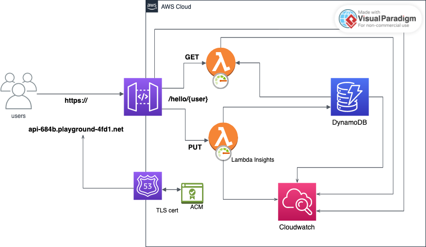
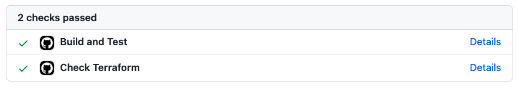
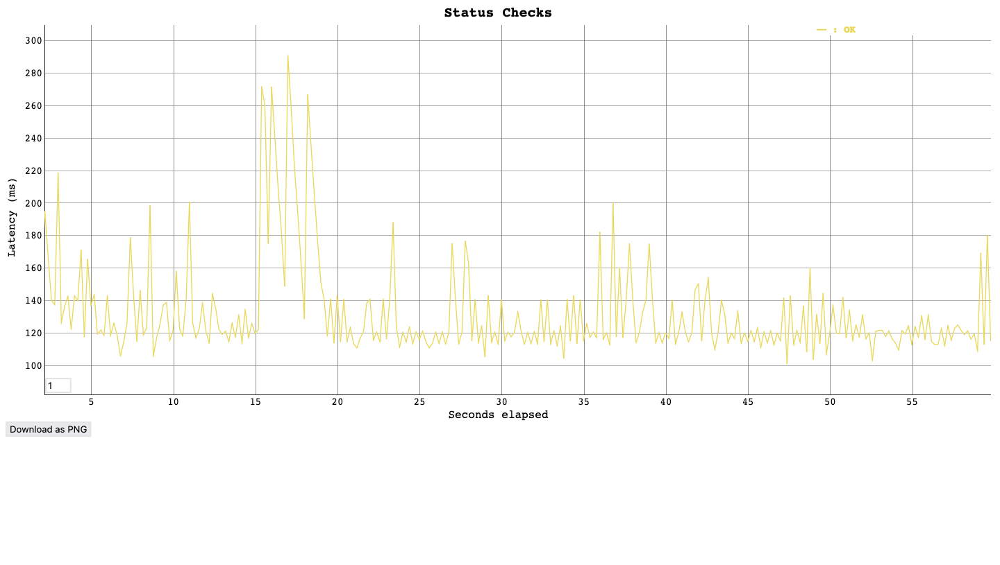

## hello-revolut

### Prerequisites
- GNU/Linux or MacOS X with Bash and Make tools installed.
- A Docker environment with docker-compose.
- An AWS free-tier account. Please save admin credentials to `~/.aws/credentials` under `[playground_iac]` profile.
- [AWS CLI v2](https://docs.aws.amazon.com/cli/latest/userguide/getting-started-install.html)
- [AWS SAM CLI](https://docs.aws.amazon.com/serverless-application-model/latest/developerguide/install-sam-cli.html) to manage local environment for serverless goodness.
- [Terraform 1.6.0+](https://developer.hashicorp.com/terraform/downloads) to manage deployments
- [Go 1.19](https://go.dev/dl/) distribution for your platform. It's somewhat old, but it's the one I develop other projects with. No surprises.
- [Vegeta HTTP Attack tool](https://github.com/tsenart/vegeta)
- [awslogs tool](https://github.com/jorgebastida/awslogs)

### Rationale
This is my proposed DevOps project for a simple birthday greeter REST app:

```

   # Add or update {user} with birthday
   # {user} must contain only letters
=> PUT /hello/{user}
     Content-Type: application/json
     # yyyy-mm-dd must be any date before today
       { "dateOfBirth": "yyyy-mm-dd"}
<= 204 No Content

   # Greet {user}
   # {user} must contain only letters
=> GET /hello/{user}
<= 200 OK
     Content-Type: application/json
     # Birthday is not today
       {"message": "Hello, {user}! Your birthday is in N day(s)"}
     # Birthday is today
       {"message": "Hello, {user}! Happy birthday!"}
```

API HTTP errors have the following structure:
```
{
  "message": <error description for users>,
  "requestId" <correlation id for logs>
}
```
For concrete examples, please read [errors_test.go](transport/errors_test.go).


The solution is fully deployable to AWS. To keep things simple and secure, I decided to apply the Serverless philosophy:
- The app is stateless.
- Each endpoint can be easily mapped to a function.
- Common aspects (repository, transport) can be reused as the API grows.
- Functions are the building blocks of microservices. Good, decoupled contracts and local tests make E2E testing unnecessary.
- Produce metrics and logs for each function and the API gateway.
- NoOps is better DevOps.

I've chosen DynamoDB, as it's the go-to database for AWS Lambdas. However, there are some quirks:
- There's a single primary key (aka hash key) on Id. DynamoDB hash keys should be optimized so they are distributed randomly across the ring nodes. This is the reason why I've chosen to SHA-256 the `{username}` attribute and use this random-ish string as our `BirthdayTable` PK.
- According to [Lambda documentation](https://docs.aws.amazon.com/lambda/latest/dg/lambda-runtime-environment.html), lambda environment is initialized once (cold start) and executed several times after that (warm execution). That means we can define and reuse database connections between invocations if we put the client outside our executive function.

If needed, authorization (and other standard integrations) can be implemented in the API Gateway. There's no need to deal with access control in our lambdas.

### System diagram


#### Live API
The virtual host is: `api-684b.playground-4fd1.net`. It's a domain I use for my personal lab projects. The API Gateway can also be accessed publicly at: `xxxxx.execute-api.eu-west-1.amazonaws.com`.
```
$ curl -H "Content-Type:application/json" -X PUT \
       -d '{"dateOfBirth":"1978-06-18"}' \
       https://api-684b.playground-4fd1.net/hello/nando

$
$ curl https://api-684b.playground-4fd1.net/hello/nando
{"message":"Hello, nando! Your birthday is in 246 day(s)"}

```

### serverless.tf
As for the practical IaC implementation aspects, I've chosen [serverless.tf](https://serverless.tf/) to manage my lambdas:
- 100% Terraform-friendly, unlike other alternatives that impose a programming framework for apps ([Chalice](https://aws.github.io/chalice/)) or compete with AWS ([Serverless](https://www.serverless.com/)).
  - [Lambda](https://registry.terraform.io/modules/terraform-aws-modules/lambda/aws) module and examples.
  - [API Gateway](https://registry.terraform.io/modules/terraform-aws-modules/apigateway-v2) module and examples.
  - [DynamoDB](https://registry.terraform.io/modules/terraform-aws-modules/dynamodb-table) module and examples.
- Well-supported in AWS' own [Serverless Application Model](https://docs.aws.amazon.com/serverless-application-model/latest/developerguide/what-is-sam.html) (SAM), although there are still some caveats (See [Tradeoffs](#tradeoffs) section below). AWS is working on achieving Terraform-SAM compatibility:
  - [With vanilla Terraform](https://aws.amazon.com/blogs/compute/better-together-aws-sam-cli-and-hashicorp-terraform/)
  - [With serverless.tf](https://docs.aws.amazon.com/serverless-application-model/latest/developerguide/using-samcli-serverlesstf.html)
  - [This presentation](https://www.youtube.com/watch?v=rPnSDrsipRs) from AWS Community Day Nordics 2023 got my attention.
  - [aws-sam-terraform-examples](https://github.com/aws-samples/aws-sam-terraform-examples).
  - [serverless.tf-playground](https://github.com/antonbabenko/serverless.tf-playground/tree/master) module and examples.

### Deployment (Terraform)
All the infra is stored under the `deploy/` dir. New lambdas can be easily added just by editing `lambdas.tf` and `api_gateway.tf`. Please mind that the source code lives outside Terraform. Each lambda is mapped to a ZIP file under `dist/`. For a complete deployment, just type `make deploy`.

**NB** Atm each time `make deploy` is invoked, all lambdas are redeployed regardless of changes. This is because the ZIP checksums are different across each `go build` run. It's pretty easy to fix though: eg add a condition in deploy only if the github commit has changed. See: [building-and-packaging](https://registry.terraform.io/modules/terraform-aws-modules/lambda/aws/latest#a-namebuild-packagea-how-does-building-and-packaging-work) at serverless.tf lambda docs.

### Development (Go)
Golang is my favorite language atm. It's very expressive, easy to learn and productive. Why not create a way to develop lambdas in Go and then be able to deploy them? Well, here it is:
```
.
├── deploy
│   ├── …
│   ├── api_gateway.tf <--- endpoints
│   ├── lambdas.tf     <--- lambdas
│   └── …
├── dist
│   └── (ZIP packages to be deployed)
|
├── functions
│   └── get-foo
│       └── (simple main function calling to services & transport)
|
├── service
│   └── (domain objects, repo and storage)
|
├── testdata
│   └── (fixtures for tests)
└── transport
    └── (deal eith requests and responses)
```

**NB** The structure might not seem very Go-like, but it's more understandable IMO. For more purity, it can evolve towards a [modular monlith](https://leonardqmarcq.com/posts/go-project-structure-for-api-gateway-lambda-with-aws-sam).

#### Local env
Each function has a Makefile with the following goals:
- **build** fast-builds the project, with instant feedback.
- **dist** generates cross-compiled binary (`bootstrap`) for containerized lambda testing.
- **run** spins up a local HTTP gateway and a lambda worker pointing to the `bootstrap` binary.
- **zip** generates package in `dist/` dir. It's called by the top-level Makefile to deploy everything. It can also be used before deploying with Terraform manually.

#### Unit tests
The easiest way to run them all is via the top-level Makefile: `make test`.

**NB** I don't recommend testing the `main.go` files for non CLI apps. It's just a collection of simple calls with no associated logic.

#### Benchmarks
For completeness sake, I've added a simple benchmark for the most algorithmic path of the app: getting remaining days until next birthday. To run it kust `cd service; go test -bench=.`

#### HTTP Integration testing
For each function, there's a SAM `template.yaml` file describing a simple lambda and a gateway to access it via HTTP. There's also a `docker-compose.yaml` file that starts up an `amazon/dynamodb-local` container. It can be accessed externally via `http://localhost:8000` or as `http://dynamo:8000` inside `lambda-local` Docker network from `template.yml`.

##### Session A
```
$ cd functions/put-birthday
make run
go clean
rm -f main bootstrap
GOOS=linux GOARCH=amd64 CGO_ENABLED=0 GOFLAGS=-trimpath go build -mod=readonly -ldflags='-s -w' -o bootstrap -v
docker-compose --file ../../docker-compose.yaml up -d --remove-orphans dynamo
[+] Building 0.0s (0/0)                                            docker:desktop-linux
[+] Running 2/2
 ✔ Network lambda-local              Created                                       0.1s
 ✔ Container hello-revolut-dynamo-1  Started                                       0.1s
sleep 2
aws dynamodb create-table --no-cli-pager --cli-input-json file://../../testdata/create-ddb-table.json --endpoint-url http://localhost:8000
…
bash -c "trap 'docker-compose --file ../../docker-compose.yaml down' EXIT; sam local start-api --docker-network lambda-local"
Mounting Greeter at http://127.0.0.1:3000/hello/{username} [PUT]
You can now browse to the above endpoints to invoke your functions. You do not need to
restart/reload SAM CLI while working on your functions, changes will be reflected
instantly/automatically. If you used sam build before running local commands, you will
need to re-run sam build for the changes to be picked up. You only need to restart SAM
CLI if you update your AWS SAM template
2023-10-16 02:38:36 WARNING: This is a development server. Do not use it in a production deployment. Use a production WSGI server instead.
 * Running on http://127.0.0.1:3000
2023-10-16 02:38:36 Press CTRL+C to quit
Invoking main (provided.al2)
Local image is up-to-date
Using local image: public.ecr.aws/lambda/provided:al2-rapid-x86_64.

Mounting /Users/nando/d/playground/hello-revolut/functions/put-birthday as
/var/task:ro,delegated, inside runtime container
START RequestId: ab80d7d6-7b5a-4f77-87cc-032fdc244de2 Version: $LATEST
END RequestId: ab80d7d6-7b5a-4f77-87cc-032fdc244de2
REPORT RequestId: ab80d7d6-7b5a-4f77-87cc-032fdc244de2  Init Duration: 0.47 ms  Duration: 303.30 ms     Billed Duration: 304 ms Memory Size: 128 MB     Max Memory Used: 128 MB

2023-10-16 02:57:53 127.0.0.1 - - [16/Oct/2023 02:57:53] "PUT /hello/foo HTTP/1.1" 204 -

```
_(Exit with ^C)_

##### Session B
```
$ curl -v -H "Content-Type:application/json" \
       -X PUT -d '{"dateOfBirth":"1989-01-09"}' \
       http://127.0.0.1:3000/hello/foo
$
$ aws dynamodb execute-statement --no-cli-pager --statement "SELECT * FROM Birthdays" --endpoint-url http://localhost:8000

{
    "Items": [
        {
            "Dob": {
                "S": "1989-01-09T00:00:00Z"
            },
            "Id": {
                "S": "2c26b46b68ffc68ff99b453c1d30413413422d706483bfa0f98a5e886266e7ae"
            }
        }
    ]
}
```

#### Event integration testing
The AWS SAM model allows developers to test resources defined in `template.yaml` with naked events:
```
$ cd functions/get-birthday
$ sam local invoke Greeter -e ../../testdata/events-get.json
Invoking main (provided.al2)
Local image is up-to-date
Using local image: public.ecr.aws/lambda/provided:al2-rapid-x86_64.

Mounting /Users/nando/d/playground/hello-revolut/functions/get-birthday as
/var/task:ro,delegated, inside runtime container
START RequestId: b03c01db-8b48-44e0-a3af-643fafde5f08 Version: $LATEST
2023/10/17 03:39:33 INFO - status: 404, message: username not found, requestId: id=, error: GetBirthday: alice, username not found
END RequestId: b03c01db-8b48-44e0-a3af-643fafde5f08
REPORT RequestId: b03c01db-8b48-44e0-a3af-643fafde5f08  Init Duration: 0.89 ms  Duration: 634.08 ms     Billed Duration: 635 ms Memory Size: 128 MB     Max Memory Used: 128 MB
{"statusCode": 404, "headers": {"Content-Type": "application/json"}, "multiValueHeaders": null, "body": "{\"message\":\"username not found\",\"requestId\":\"id=\"}", "cookies": null}
```
_(Exit with ^C)_

However, I didn't find this useful for HTTP events. OTOH this testing method is quite handy for functions consuming ie SQS/SNS/SES messsages. Or also events carrying AWS metadata (ie Cognito).

#### Learning resources
- [Lambda handler in Go](https://docs.aws.amazon.com/lambda/latest/dg/golang-handler.html)
- [Lambda Go SDK examples](https://github.com/awsdocs/aws-doc-sdk-examples/tree/main/gov2/lambda)
- [aws-lambda-go-api-proxy](https://github.com/awslabs/aws-lambda-go-api-proxy)

### Monitoring
#### Logs
All logs are forwarded to CloudWatch:
```
$ awslogs get /aws/lambda/xxx-lambda-get --aws-region eu-west-1 --profile playground_iac -w

/aws/lambda/smart-lion-lambda-put 2023/10/17/[$LATEST]97a65254cb544195852fd8738db36992 INIT_START Runtime Version: provided:al2.v24      Runtime Version ARN: arn:aws:lambda:eu-west-1::runtime:81d6fc3f612653d45ec654b442cabc69425b90001d6194d931e501a2c7bc7bb3
/aws/lambda/smart-lion-lambda-put 2023/10/17/[$LATEST]97a65254cb544195852fd8738db36992 LOGS      Name: cloudwatch_lambda_agent   State: Subscribed       Types: [Platform]
/aws/lambda/smart-lion-lambda-put 2023/10/17/[$LATEST]97a65254cb544195852fd8738db36992 EXTENSION Name: cloudwatch_lambda_agent   State: Ready    Events: [INVOKE, SHUTDOWN]
/aws/lambda/smart-lion-lambda-put 2023/10/17/[$LATEST]97a65254cb544195852fd8738db36992 START RequestId: 3beb80df-4951-4348-b375-f9df632bc995 Version: $LATEST
/aws/lambda/smart-lion-lambda-put 2023/10/17/[$LATEST]97a65254cb544195852fd8738db36992 END RequestId: 3beb80df-4951-4348-b375-f9df632bc995
/aws/lambda/smart-lion-lambda-put 2023/10/17/[$LATEST]97a65254cb544195852fd8738db36992 REPORT RequestId: 3beb80df-4951-4348-b375-f9df632bc995    Duration: 937.73 ms     Billed Duration: 1142 ms Memory Size: 128 MB     Max Memory Used: 47 MB  Init Duration: 203.47 ms

----

$ awslogs get /aws/lambda/xxx-lambda-put --aws-region eu-west-1 --profile playground_iac -w

/aws/lambda/smart-lion-lambda-get 2023/10/17/[$LATEST]8da619ea558b4e789642098bacc1c63c INIT_START Runtime Version: provided:al2.v24      Runtime Version ARN: arn:aws:lambda:eu-west-1::runtime:81d6fc3f612653d45ec654b442cabc69425b90001d6194d931e501a2c7bc7bb3
/aws/lambda/smart-lion-lambda-get 2023/10/17/[$LATEST]8da619ea558b4e789642098bacc1c63c LOGS      Name: cloudwatch_lambda_agent   State: Subscribed       Types: [Platform]
/aws/lambda/smart-lion-lambda-get 2023/10/17/[$LATEST]8da619ea558b4e789642098bacc1c63c EXTENSION Name: cloudwatch_lambda_agent   State: Ready    Events: [INVOKE, SHUTDOWN]
/aws/lambda/smart-lion-lambda-get 2023/10/17/[$LATEST]8da619ea558b4e789642098bacc1c63c START RequestId: c153d244-aa74-40ec-b99a-6f144eb05115 Version: $LATEST
/aws/lambda/smart-lion-lambda-get 2023/10/17/[$LATEST]8da619ea558b4e789642098bacc1c63c END RequestId: c153d244-aa74-40ec-b99a-6f144eb05115
/aws/lambda/smart-lion-lambda-get 2023/10/17/[$LATEST]8da619ea558b4e789642098bacc1c63c REPORT RequestId: c153d244-aa74-40ec-b99a-6f144eb05115    Duration: 951.01 ms     Billed Duration: 1147 ms Memory Size: 128 MB     Max Memory Used: 47 MB  Init Duration: 195.08 ms

----

$ awslogs get /aws/apigw/xxx-http --aws-region eu-west-1 --profile playground_iac -w

/aws/apigw/smart-lion-http h933wewkw9_.default-2023-10-17-04-12 46.6.213.31 - - [17/Oct/2023:04:12:46 +0000] "GET GET /hello/{username} HTTP/1.1" 200 56 M7Z1whVnDoEEJuw= -
/aws/apigw/smart-lion-http h933wewkw9_.default-2023-10-17-04-15 46.6.213.31 - - [17/Oct/2023:04:15:22 +0000] "PUT PUT /hello/{username} HTTP/1.1" 204 0 M7aOJhvDjoEEM0g= -

```

**NB** I'm using the same AWS API user across all this exercise. I should have created a cloudwatch-only profile.

#### Metrics
Atm only accessible via CloudWatch dashboards.
- https://docs.aws.amazon.com/lambda/latest/dg/monitoring-metrics.html
- https://docs.aws.amazon.com/AmazonCloudWatch/latest/monitoring/Lambda-Insights.html

### Github Actions
On all open PRs, unit tests and terraform linting/validation are executed.


### Tradeoffs
#### Local env based on SAM
serverless.tf is a pretty active project. Some of its features keep up a faster pace than SAM does. This results in `sam local invoke --hook-name terraform module.my_function.…` not working with serverless.tf's [apigateway-v2.integrations](https://registry.terraform.io/modules/terraform-aws-modules/apigateway-v2/aws/latest#input_integrations). For this reason, I decided to use SAM only for local testing, via a dummy `template.yaml`.

#### zero-downtime deploys
_For most cases_. AWS lambdas have zero-downtime deploys. Of course, this depends on usage characteristics of the system. Having said this, handling these kind of scenarios outgrows AWS free-tier capabilities (eg. [provisioned concurrency](https://aws.amazon.com/ru/blogs/compute/new-for-aws-lambda-predictable-start-up-times-with-provisioned-concurrency/)). To prevent additional costs, rolling deployments can be also achieved via AWS CodeDeploy with additional benefits (ie blue/green, canary, …). TBH I didn't have enough time to explore this alternative.  Additionally, IMO, before tackling this deployment/pipeline complexity, we could arguably consider increase Dynamodb read/rite provisioned capacity. Or even switch from x86 lambda workers to ARM ones.

**tl/dr;** I'll consider the _potential-pico-downtime deploys_ as just good enough. I've coded a small utility to be run while lambda functions are being redeployed. The concurrency can be tuned. Atm it's set to 5 rps for 60 secs. Again, pretty reasonable within our free-tier constraints.

```
$ cd scripts
$ ./check-deployment.sh
Starting status checks (report)… Please wait.

Requests      [total, rate, throughput]         300, 5.02, 5.00
Duration      [total, attack, wait]             59.989s, 59.799s, 189.904ms
Latencies     [min, mean, 50, 90, 95, 99, max]  93.297ms, 127.934ms, 119.291ms, 150.431ms, 168.173ms, 240.294ms, 686.36ms
Bytes In      [total, mean]                     8400, 28.00
Bytes Out     [total, mean]                     5100, 17.00
Success       [ratio]                           100.00%
Status Codes  [code:count]                      200:150  204:150
Error Set:
```

Please use `./check-deployment.sh plot` for a fancier output:

To make some sense out of any potential downtime during `terraform apply`, we should inspect lambda insights throttling, warmup and parallelism events in Cloudwatch. For example, we could be getting "false deploy downtime" for a high request volume that is cut off by the lambda runtime.

### Further improvements
- Provide an OpenAPI template.
- Handle throttling/timeouts in the code, via `eventContext`.
  - https://aws.amazon.com/blogs/compute/error-handling-patterns-in-amazon-api-gateway-and-aws-lambda/
- Export cloudwatch metrics to dashboards (minisite or grafana).
  - https://docs.aws.amazon.com/AmazonCloudWatch/latest/monitoring/cloudwatch-dashboard-sharing.html
  - https://grafana.com/docs/grafana/latest/datasources/aws-cloudwatch/
  - https://aws.amazon.com/blogs/opensource/using-amazon-managed-service-for-grafana-to-troubleshoot-a-serverless-application/
- Setup a deployment pipeline in Github,
- Provide remote dev env, via terraform workspace and dedicated VPC & IAM roles.
- Advance towards a more advanced deployment strategy (eg blue/green). I'd need to study serverless.tf more deeply.

